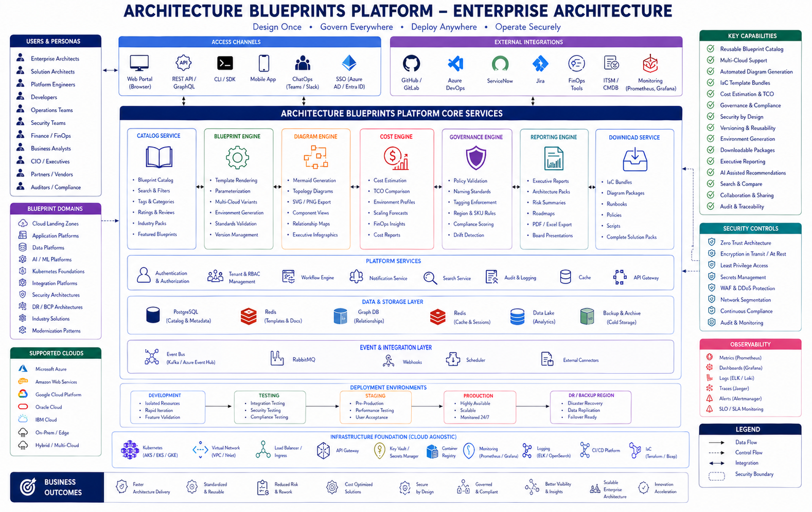
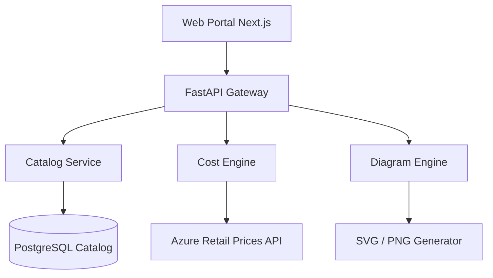
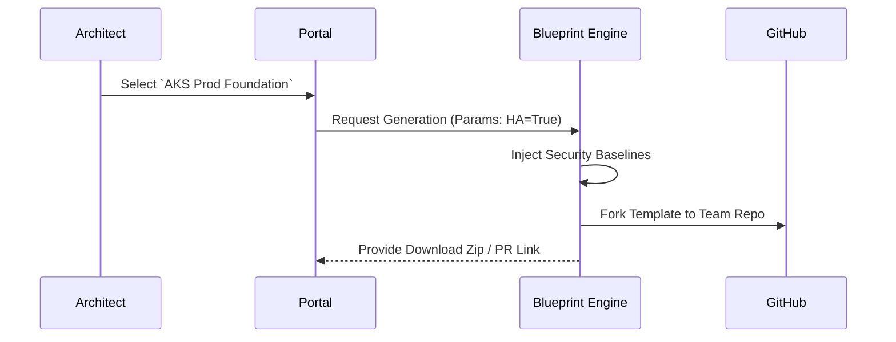
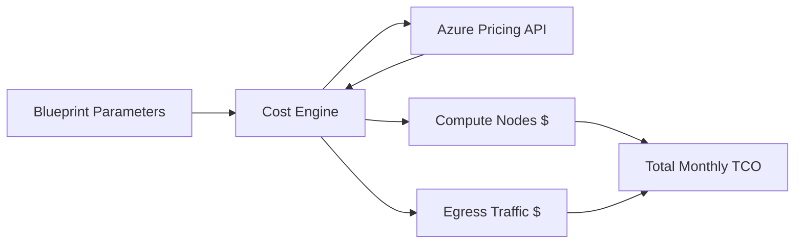
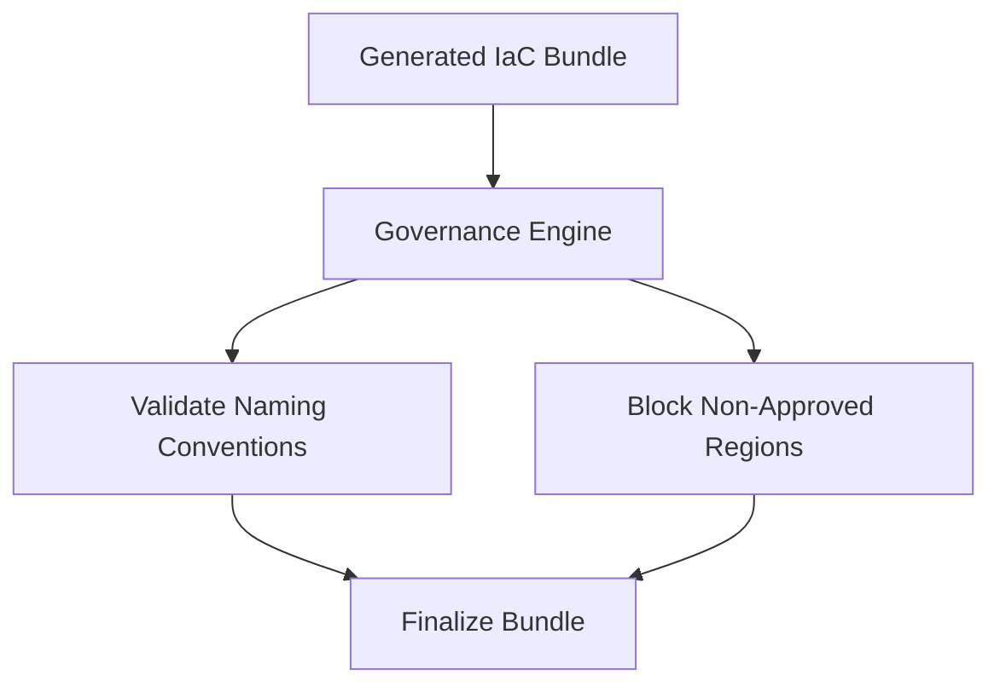
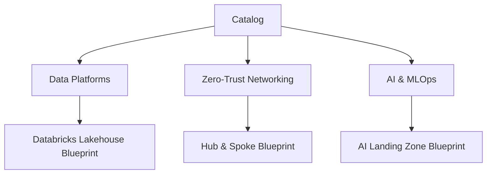
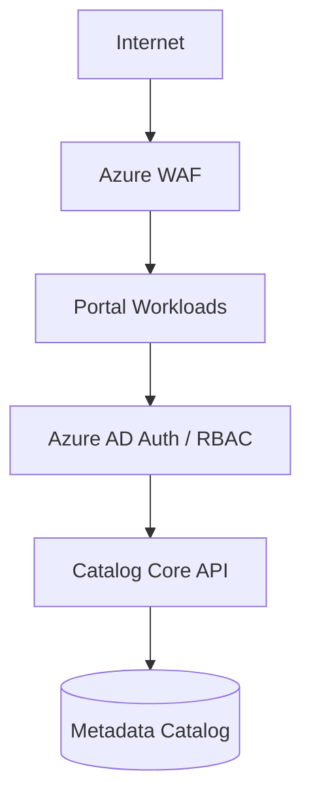
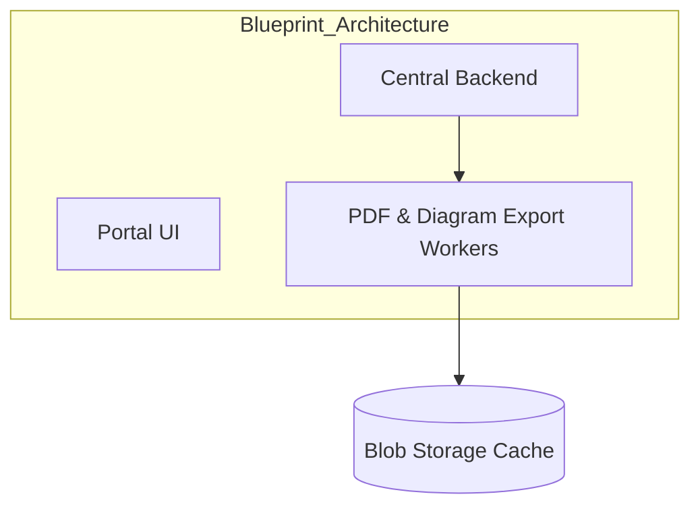
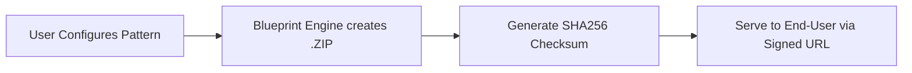

<div align="center">


<h1>Architecture Blueprints Platform</h1>

<p><strong>The Enterprise Architecture Catalog: Design Once, Govern Everywhere, Deploy Anywhere</strong></p>

[](https://devopstrio.co.uk/)
[](/terraform)
[](/apps/cost-engine)
[](https://devopstrio.co.uk/)

</div>

---

## 🏛️ Executive Summary



The **Architecture Blueprints Platform** is the centralized, vetted, and secure source of truth for all foundational enterprise solutions. Rather than reinventing cloud networking, Kubernetes perimeters, and MLOps platforms from scratch, architects download certified, cost-evaluated Infrastructure-as-Code (IaC) bundles ready for immediate deployment.

### Strategic Business Outcomes
- **Standardized Landing Zones**: Enforces security-by-default logic across Azure, AWS, and GCP.
- **Automated Diagram Generation**: Transforms abstract parameter selections into high-fidelity Mermaid/SVG topology maps dynamically.
- **FinOps Cost TCO Modeling**: Every blueprint bundle generates accurate monthly cost profiles based on region, SKU selection, and bandwidth estimates *before* infrastructure is created.
- **Zero-Trust Governance**: Ensures every downloaded terraform bundle natively includes WAFs, Private Endpoints, and strictly scoped RBAC boundaries.

---

## 🏗️ Technical Architecture Details

### 1. High-Level Architecture


### 2. Blueprint Downloading Workflow


### 3. Cost Estimation Flow


### 4. Governance Validation Flow


### 5. Multi-Tenant Reference Catalog


### 6. Security Trust Boundary


### 7. Core Workload Topology (AKS)


### 8. Download Package Lifecycle


---

## 🛠️ Global Platform Components

| Engine | Directory | Purpose |
|:---|:---|:---|
| **Portal UI** | `apps/portal/` | The Next.js Executive Catalog, displaying architectures and prices. |
| **Platform API** | `backend/src/` | Centralized router governing all downloads and catalog searches. |
| **Blueprint Engine** | `apps/blueprint-engine/`| Generates customized Terraform/Bicep from parameterized templates. |
| **Cost Engine** | `apps/cost-engine/` | Interacts with external pricing APIs to calculate infrastructure TCO. |
| **Diagram Engine** | `apps/diagram-engine/` | Automatically draws system architectures based on user selections. |

---

## 🚀 Environment Deployment

Provision the catalog framework.

```bash
cd bicep
az deployment sub create --name blueprints-platform --location uksouth --template-file main.bicep
```

---
<sub>&copy; 2026 Devopstrio &mdash; Architecting the Enterprise.</sub>
